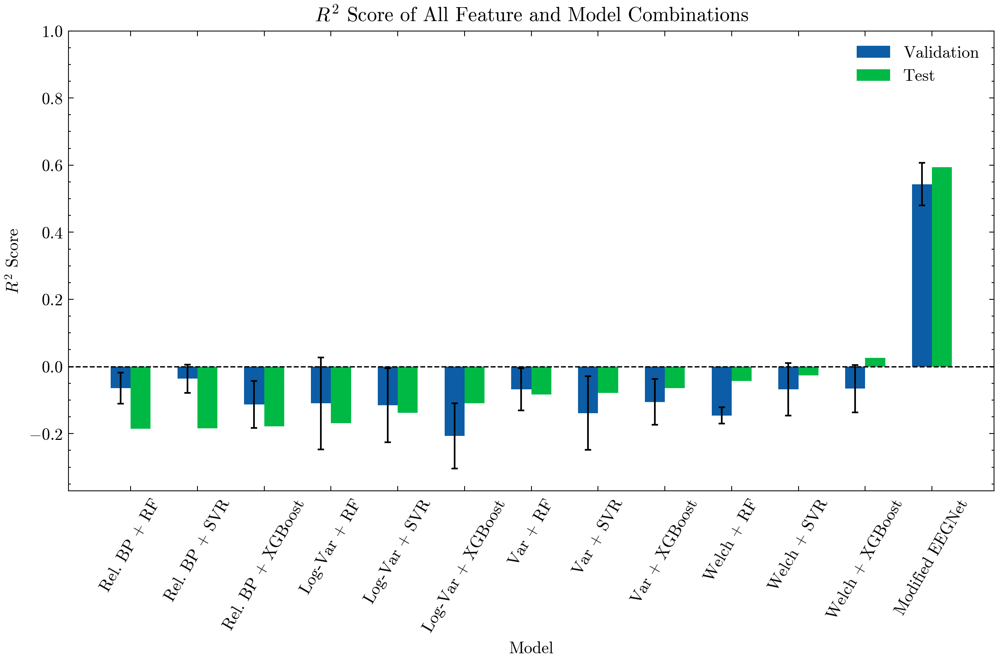

# Predicting Perceived Stress from Resting State EEG

Can we measure perceived stress from brain recordings? The answer turns out to be yes. But how we got there is also important.

In this work, we analyzed the Leipzig Study for Mind-Body-Emotion Interactions (LEMON) dataset which includes various psychological and physiological measurements.

Specifically, we trained three different models on manually extracted features. Then the EEGNet architecture was used to train a model on the continuous EEG data without any manual feature extraction. The models were then evaulated using the R2 score.

## Results

From the R2 scores, it can be seen that the EEGNet vastly outperforms all the other models and can thus predict stress levels from resting state EEG data.

